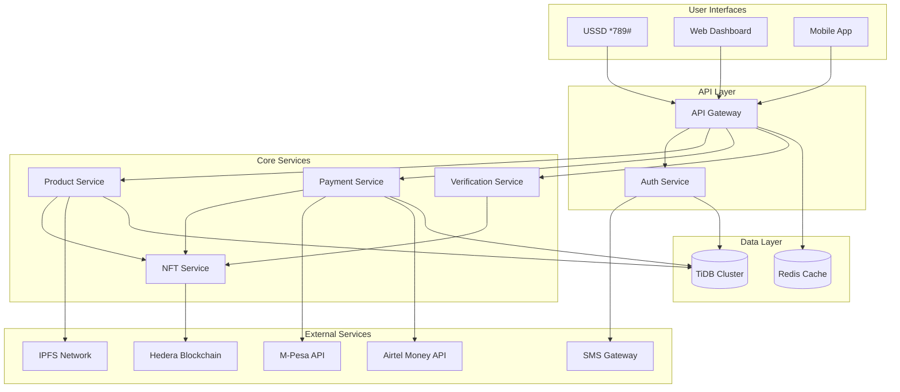
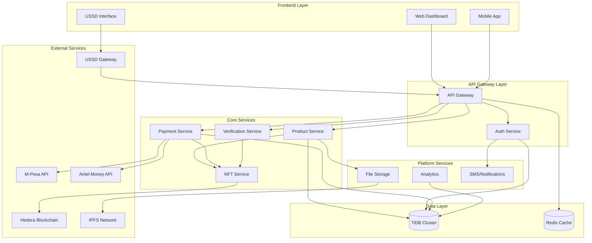
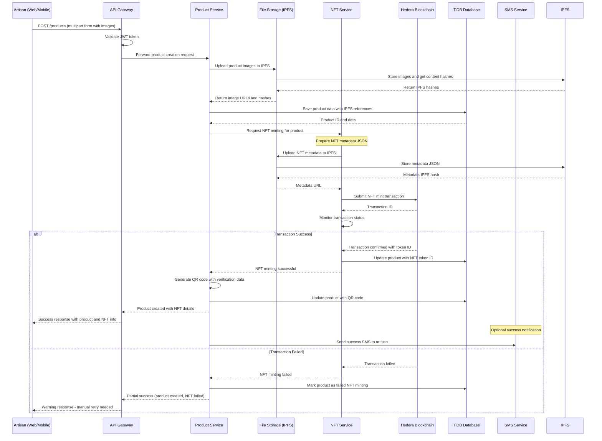
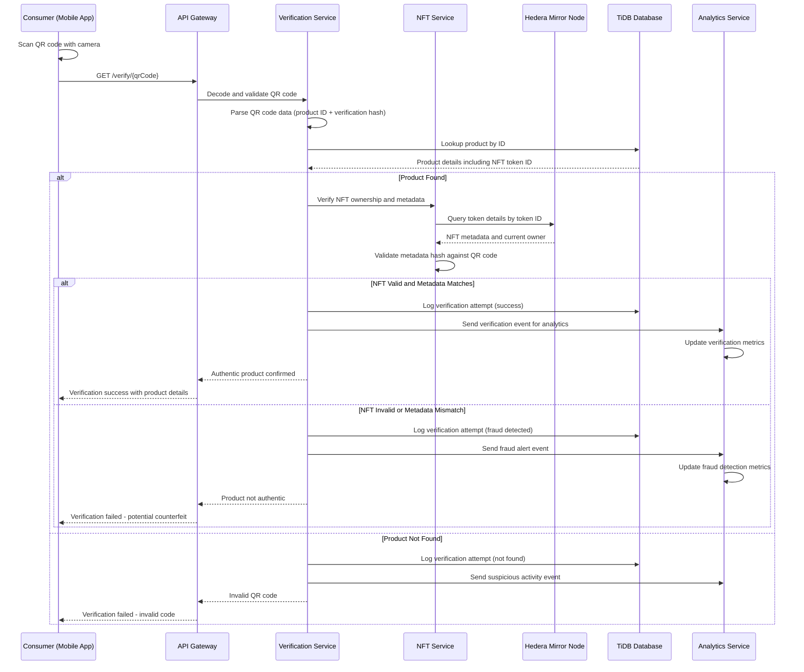
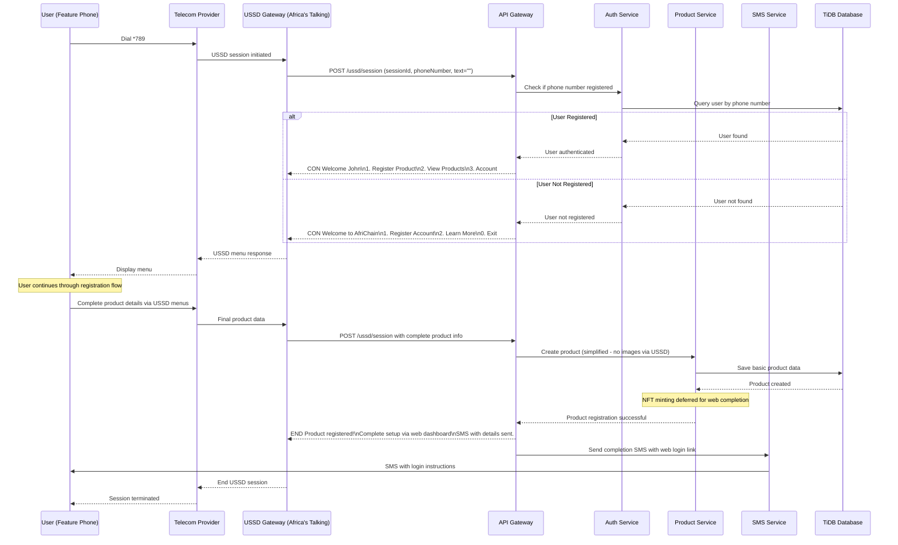
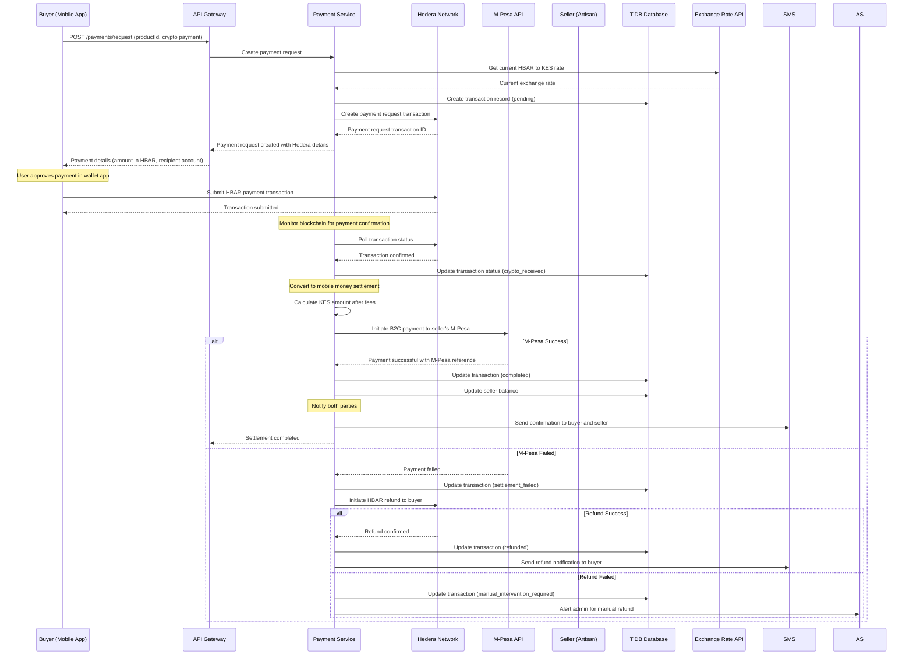

# AfriChain Authenticity Fullstack Architecture Document

## Introduction

This document outlines the complete fullstack architecture for AfriChain Authenticity, including backend systems, frontend implementation, and their integration. It serves as the single source of truth for AI-driven development, ensuring consistency across the entire technology stack.

This unified approach combines what would traditionally be separate backend and frontend architecture documents, streamlining the development process for modern fullstack applications where these concerns are increasingly intertwined.

### Starter Template or Existing Project

**N/A - Greenfield project**

This is a custom greenfield architecture designed specifically for the unique requirements of blockchain-based authenticity verification with multi-channel access (USSD, web, mobile) and crypto-to-mobile money payment bridge functionality.

### Change Log

| Date | Version | Description | Author |
|------|---------|-------------|--------|
| 2025-01-10 | 1.0 | Initial architecture document | Winston (BMAD Architect) |

## High Level Architecture

### Technical Summary

AfriChain Authenticity implements a cloud-native microservices architecture with Docker containerization, supporting multi-channel access through USSD (*789#), web dashboard, and mobile applications. The frontend uses Next.js 14 with React for web interfaces and React Native for mobile, while the backend leverages Node.js with Express for API services. Key integration points include Hedera Hashgraph blockchain for NFT minting, TiDB distributed database for scalable data storage, and IPFS for decentralized file storage. The platform bridges crypto payments to mobile money systems (M-Pesa/Airtel Money), achieving the PRD goals of authentic product verification, artisan empowerment, and accessible technology for African markets.

### Platform and Infrastructure Choice

**Platform:** Multi-cloud with primary deployment on Vercel (frontend) and Railway/AWS (backend)
**Key Services:** Vercel Edge Functions, Railway PostgreSQL, AWS S3, IPFS (Infura), Redis Cloud
**Deployment Host and Regions:** Primary: US East (low latency to Africa), Secondary: EU West (backup)

The platform choice balances rapid development capabilities with enterprise scalability. Vercel provides excellent Next.js optimization and global CDN, while Railway offers simple deployment with managed databases. AWS services provide enterprise-grade reliability for critical blockchain and payment operations.

### Repository Structure

**Structure:** Monorepo with shared packages
**Monorepo Tool:** npm workspaces (native Node.js solution)
**Package Organization:** Apps (web, mobile, api) + shared packages (types, utilities, components)

The monorepo approach enables code sharing between frontend and backend, especially for TypeScript interfaces and business logic, while maintaining clear boundaries between different application targets.

### High Level Architecture Diagram



### Architectural Patterns

- **Microservices Architecture:** Service-based design with clear boundaries - _Rationale:_ Enables independent scaling and deployment of blockchain, payment, and product services
- **API Gateway Pattern:** Single entry point with authentication and routing - _Rationale:_ Centralized security, rate limiting, and request logging for all client types
- **Event-Driven Architecture:** Async processing for blockchain and payment operations - _Rationale:_ Handles long-running blockchain transactions without blocking user interfaces
- **CQRS Pattern:** Separate read/write operations for high-frequency verification queries - _Rationale:_ Optimizes performance for product verification while maintaining data consistency
- **Circuit Breaker Pattern:** Fault tolerance for external API integrations - _Rationale:_ Graceful degradation when blockchain or payment APIs are unavailable

## Tech Stack

### Technology Stack Table

| Category | Technology | Version | Purpose | Rationale |
|----------|------------|---------|---------|-----------|
| Frontend Language | TypeScript | 5.3+ | Type-safe client development | Shared types with backend, better developer experience |
| Frontend Framework | Next.js | 14.x | React-based web application | App Router, SSR capabilities, Vercel optimization |
| UI Component Library | Tailwind CSS + shadcn/ui | Latest | Design system and components | Rapid development, customizable, mobile-first |
| State Management | React Query + Zustand | Latest | Server state and client state | Simplified data fetching, efficient caching |
| Backend Language | Node.js | 20 LTS | JavaScript runtime | Full-stack TypeScript, ecosystem maturity |
| Backend Framework | Express.js | 4.18+ | REST API server | Mature, extensive middleware ecosystem |
| API Style | REST API | OpenAPI 3.0 | Client-server communication | USSD compatibility, simple integration |
| Database | TiDB | Cloud | Distributed SQL database | MySQL compatibility, horizontal scaling |
| Cache | Redis | 7.x | Session and response caching | High performance, pub/sub capabilities |
| File Storage | IPFS | Latest | Decentralized file storage | Immutable NFT metadata, censorship resistance |
| Authentication | JWT + Phone OTP | Latest | Multi-channel authentication | USSD-friendly, passwordless for Africa |
| Frontend Testing | Vitest + React Testing Library | Latest | Unit and integration tests | Faster than Jest, React-focused |
| Backend Testing | Jest + Supertest | Latest | API testing | Mature testing ecosystem |
| E2E Testing | Playwright | Latest | End-to-end automation | Multi-browser, mobile testing |
| Build Tool | Vite | Latest | Frontend build system | Fast development, optimized bundling |
| Bundler | Native (Next.js/Vite) | Latest | Asset bundling | Framework-integrated optimization |
| IaC Tool | Docker + Railway | Latest | Infrastructure deployment | Simplified container deployment |
| CI/CD | GitHub Actions | Latest | Automated deployment | Integrated with repository, free tier |
| Monitoring | Sentry + Vercel Analytics | Latest | Error tracking and performance | Real-time monitoring, user insights |
| Logging | Winston + Railway Logs | Latest | Application logging | Structured logging, centralized collection |
| CSS Framework | Tailwind CSS | 3.x | Utility-first styling | Rapid prototyping, mobile-responsive |

## Data Models

### Core Business Entities

Based on the AfriChain Authenticity PRD, the platform requires several key data models that support blockchain NFT integration, multi-currency transactions, and product authenticity verification.

#### User Model
**Purpose:** Represents artisans, consumers, and platform users with phone-based authentication suitable for African markets

**Key Attributes:**
- id: string (UUID) - Primary identifier
- phoneNumber: string - Primary authentication method (Kenya format)
- name: string - User's full name
- location: string - County/region for marketplace
- businessType: enum - Type of artisan craft
- hederaAccountId: string - Blockchain account for NFT operations
- mpesaNumber: string - Mobile money account
- isVerified: boolean - Phone verification status
- createdAt: Date - Account creation timestamp
- updatedAt: Date - Last modification timestamp

**TypeScript Interface:**
```typescript
interface User {
  id: string;
  phoneNumber: string;
  name: string;
  location: string;
  businessType: 'woodwork' | 'textiles' | 'pottery' | 'jewelry' | 'metalwork' | 'other';
  hederaAccountId?: string;
  mpesaNumber?: string;
  isVerified: boolean;
  createdAt: Date;
  updatedAt: Date;
}
```

**Relationships:**
- One-to-many with Product (artisan creates multiple products)
- One-to-many with Transaction (user can have multiple transactions)

#### Product Model
**Purpose:** Core entity representing authentic products with blockchain certificates and QR verification codes

**Key Attributes:**
- id: string (UUID) - Primary identifier
- artisanId: string (UUID) - Creator reference
- name: string - Product name
- description: string - Detailed product description
- price: number - Product price
- currency: enum - KES or USD
- category: enum - Product category matching artisan business type
- images: string[] - IPFS URLs for product photos
- qrCode: string - Base64 encoded verification QR code
- nftTokenId: string - Hedera token identifier
- status: enum - Product lifecycle status
- createdAt: Date - Registration timestamp

**TypeScript Interface:**
```typescript
interface Product {
  id: string;
  artisanId: string;
  name: string;
  description: string;
  price: number;
  currency: 'KES' | 'USD';
  category: 'woodwork' | 'textiles' | 'pottery' | 'jewelry' | 'metalwork' | 'other';
  images: string[];
  qrCode?: string;
  nftTokenId?: string;
  status: 'draft' | 'active' | 'sold' | 'inactive';
  createdAt: Date;
  updatedAt: Date;
}
```

**Relationships:**
- Many-to-one with User (artisan)
- One-to-many with Transaction (product can have multiple sales attempts)
- One-to-one with NFTMetadata (blockchain certificate)

#### Transaction Model
**Purpose:** Handles complex multi-currency payments bridging crypto and mobile money systems

**Key Attributes:**
- id: string (UUID) - Primary identifier
- buyerId: string (UUID) - Purchaser reference
- sellerId: string (UUID) - Artisan reference  
- productId: string (UUID) - Product being purchased
- amount: number - Transaction amount
- currency: enum - Transaction currency
- paymentMethod: enum - Payment method used
- status: enum - Transaction lifecycle status
- hederaTransactionId: string - Blockchain transaction reference
- mobileMoneyReference: string - M-Pesa/Airtel reference
- createdAt: Date - Transaction initiation
- completedAt: Date - Settlement completion

**TypeScript Interface:**
```typescript
interface Transaction {
  id: string;
  buyerId: string;
  sellerId: string;
  productId: string;
  amount: number;
  currency: 'KES' | 'USD' | 'HBAR';
  paymentMethod: 'mpesa' | 'airtel_money' | 'crypto';
  status: 'pending' | 'processing' | 'completed' | 'failed' | 'cancelled';
  hederaTransactionId?: string;
  mobileMoneyReference?: string;
  createdAt: Date;
  completedAt?: Date;
}
```

**Relationships:**
- Many-to-one with User (buyer and seller)
- Many-to-one with Product
- One-to-many with TransactionEvent (audit trail)

#### NFTMetadata Model
**Purpose:** Blockchain-compatible metadata structure for product authenticity certificates

**Key Attributes:**
- tokenId: string - Hedera token identifier
- serialNumber: number - NFT serial number
- productId: string (UUID) - Associated product reference
- metadata: object - Standard NFT metadata structure
- accountId: string - Current owner's Hedera account
- createdTimestamp: Date - Minting timestamp
- ipfsHash: string - Metadata storage hash

**TypeScript Interface:**
```typescript
interface NFTMetadata {
  tokenId: string;
  serialNumber: number;
  productId: string;
  metadata: {
    name: string;
    description: string;
    image: string;
    attributes: Array<{
      trait_type: string;
      value: string;
    }>;
  };
  accountId: string;
  createdTimestamp: Date;
  ipfsHash: string;
}
```

**Relationships:**
- One-to-one with Product (each product has one authenticity certificate)
- Many-to-one with User (current NFT owner)

## API Specification

### REST API Specification

```yaml
openapi: 3.0.0
info:
  title: AfriChain Authenticity API
  version: 1.0.0
  description: |
    REST API for the AfriChain Authenticity platform enabling blockchain-based 
    product authenticity verification for African artisans with USSD, web, and mobile support.
    
    Key Features:
    - Multi-channel access (USSD *789#, web dashboard, mobile app)
    - Hedera Token Service (HTS) NFT minting and management
    - Crypto-to-mobile money payment bridge
    - Product authenticity verification
    - Artisan marketplace integration

servers:
  - url: https://api.africhain.app/v1
    description: Production server
  - url: https://staging-api.africhain.app/v1
    description: Staging server
  - url: http://localhost:3001/v1
    description: Development server

security:
  - BearerAuth: []
  - ApiKeyAuth: []
  - USSDAuth: []

paths:
  # USSD Gateway Endpoints
  /ussd/session:
    post:
      tags: [USSD]
      summary: Handle USSD session requests
      description: Process incoming USSD requests from telecom providers
      requestBody:
        required: true
        content:
          application/x-www-form-urlencoded:
            schema:
              type: object
              properties:
                sessionId:
                  type: string
                  description: USSD session identifier
                phoneNumber:
                  type: string
                  pattern: '^(\+254|0)[0-9]{9}$'
                text:
                  type: string
                  description: User input text
                serviceCode:
                  type: string
                  default: "*789#"
      responses:
        200:
          description: USSD response
          content:
            text/plain:
              schema:
                type: string
                example: "CON Welcome to AfriChain\n1. Register Product\n2. Verify Product\n3. View My Products"

  # Authentication Endpoints
  /auth/register:
    post:
      tags: [Authentication]
      summary: Register new artisan/user
      requestBody:
        required: true
        content:
          application/json:
            schema:
              type: object
              required: [phoneNumber, name, location]
              properties:
                phoneNumber:
                  type: string
                  pattern: '^(\+254|0)[0-9]{9}$'
                name:
                  type: string
                  minLength: 2
                  maxLength: 100
                location:
                  type: string
                  description: County/region in Kenya
                businessType:
                  type: string
                  enum: [woodwork, textiles, pottery, jewelry, metalwork, other]
                mpesaNumber:
                  type: string
                  pattern: '^(\+254|0)[0-9]{9}$'
      responses:
        201:
          description: User registered successfully

  # Product Management Endpoints
  /products:
    post:
      tags: [Products]
      summary: Register new product and mint NFT
      security:
        - BearerAuth: []
      requestBody:
        required: true
        content:
          multipart/form-data:
            schema:
              type: object
              required: [name, description, price, category]
              properties:
                name:
                  type: string
                  minLength: 2
                  maxLength: 100
                description:
                  type: string
                  maxLength: 500
                price:
                  type: number
                  minimum: 0
                currency:
                  type: string
                  enum: [KES, USD]
                  default: KES
                category:
                  type: string
                  enum: [woodwork, textiles, pottery, jewelry, metalwork, other]
                images:
                  type: array
                  items:
                    type: string
                    format: binary
                  maxItems: 5
      responses:
        201:
          description: Product registered and NFT minted

    get:
      tags: [Products]
      summary: List products with pagination and filters
      parameters:
        - name: page
          in: query
          schema:
            type: integer
            default: 1
        - name: limit
          in: query
          schema:
            type: integer
            default: 20
            maximum: 100
        - name: category
          in: query
          schema:
            type: string
            enum: [woodwork, textiles, pottery, jewelry, metalwork, other]
      responses:
        200:
          description: Products retrieved successfully

  # Verification Endpoints
  /verify/{qrCode}:
    get:
      tags: [Verification]
      summary: Verify product authenticity via QR code
      parameters:
        - name: qrCode
          in: path
          required: true
          schema:
            type: string
            description: Base64 encoded product verification data
      responses:
        200:
          description: Product authenticity verified

  # Payment Endpoints
  /payments/request:
    post:
      tags: [Payments]
      summary: Request payment for product purchase
      security:
        - BearerAuth: []
      requestBody:
        required: true
        content:
          application/json:
            schema:
              type: object
              required: [productId, amount, paymentMethod]
              properties:
                productId:
                  type: string
                  format: uuid
                amount:
                  type: number
                  minimum: 1
                currency:
                  type: string
                  enum: [KES, USD]
                paymentMethod:
                  type: string
                  enum: [mpesa, airtel_money, crypto]
      responses:
        201:
          description: Payment request created

components:
  securitySchemes:
    BearerAuth:
      type: http
      scheme: bearer
      bearerFormat: JWT
    ApiKeyAuth:
      type: apiKey
      in: header
      name: X-API-Key
    USSDAuth:
      type: apiKey
      in: header
      name: X-USSD-Session
```

## Components

### Frontend Components

#### Web Dashboard Component
**Responsibility:** Artisan management interface for product registration, sales tracking, and analytics

**Key Interfaces:**
- Product registration and editing forms
- Sales dashboard with charts and metrics
- Payment history and settlement tracking
- NFT certificate viewing and sharing

**Dependencies:** Authentication service, Product API, Payment API, File upload service

**Technology Stack:** Next.js 14 with App Router, React Query for API state, Tailwind CSS, Chart.js for analytics

#### Mobile App Component
**Responsibility:** Consumer-facing app for product discovery, authenticity verification, and purchases

**Key Interfaces:**
- QR code scanner for product verification
- Product catalog with search and filtering
- Shopping cart and checkout flow
- Payment integration with M-Pesa/Airtel Money

**Dependencies:** Product API, Verification API, Payment API, Device camera access

**Technology Stack:** React Native with Expo, React Navigation, React Native Camera

#### USSD Interface Component
**Responsibility:** Feature phone access via *789# USSD code for basic operations

**Key Interfaces:**
- Menu-driven product registration
- Simple product verification by code
- Basic account management
- Payment status checking

**Dependencies:** USSD Gateway API, SMS service, Product API (simplified)

**Technology Stack:** Node.js with Express, USSD session management, Africa's Talking SMS API

### Backend Components

#### API Gateway Component
**Responsibility:** Single entry point for all API requests with authentication, rate limiting, and routing

**Key Interfaces:**
- Request routing to appropriate services
- JWT token validation and refresh
- API key authentication for USSD
- Request/response logging and monitoring

**Dependencies:** All backend services, Redis for rate limiting

**Technology Stack:** Express.js with middleware, express-rate-limit, JWT libraries

#### Product Service Component
**Responsibility:** Core business logic for product management, registration, and catalog operations

**Key Interfaces:**
- CRUD operations for products
- Image upload and processing
- QR code generation
- Product search and filtering

**Dependencies:** Database, File Storage (IPFS), NFT Service

**Technology Stack:** Node.js with Express, Sharp for image processing, QR code libraries

#### NFT Service Component
**Responsibility:** Hedera blockchain integration for NFT minting, management, and verification

**Key Interfaces:**
- NFT minting on product registration
- Blockchain transaction monitoring
- Metadata storage on IPFS
- Token ownership verification

**Dependencies:** Hedera SDK, IPFS, Product database

**Technology Stack:** Hedera JavaScript SDK, IPFS HTTP client, Blockchain event listeners

#### Payment Service Component
**Responsibility:** Payment processing bridge between crypto (Hedera) and mobile money systems

**Key Interfaces:**
- Payment request creation and processing
- M-Pesa/Airtel Money API integration
- Crypto-to-fiat conversion rates
- Settlement and reconciliation

**Dependencies:** M-Pesa API, Airtel Money API, Hedera SDK, External exchange rate API

**Technology Stack:** Node.js payment processors, Safaricom M-Pesa SDK, Webhook handlers

### Component Diagram



## External APIs

### Hedera Hashgraph API
- **Purpose:** Blockchain operations for NFT minting, token transfers, and transaction verification
- **Documentation:** https://docs.hedera.com/hedera/sdks-and-apis
- **Base URL(s):** 
  - Testnet: `https://testnet.mirrornode.hedera.com`
  - Mainnet: `https://mainnet-public.mirrornode.hedera.com`
- **Authentication:** Account ID and Private Key pairs
- **Rate Limits:** 100 TPS for testnet, 10,000 TPS for mainnet

**Key Endpoints Used:**
- `POST /api/v1/transactions` - Submit transactions for NFT minting
- `GET /api/v1/tokens/{tokenId}` - Retrieve token information
- `GET /api/v1/accounts/{accountId}/nfts` - List NFTs owned by account
- `GET /api/v1/transactions/{transactionId}` - Get transaction status

**Integration Notes:** Requires Hedera SDK for transaction signing. All transactions require HBAR fees. NFT metadata stored on IPFS with hash referenced in token.

### Safaricom M-Pesa API
- **Purpose:** Mobile money payments for Kenyan users
- **Documentation:** https://developer.safaricom.co.ke/APIs
- **Base URL(s):** 
  - Sandbox: `https://sandbox.safaricom.co.ke`
  - Production: `https://api.safaricom.co.ke`
- **Authentication:** OAuth 2.0 Bearer tokens
- **Rate Limits:** 600 requests per minute

**Key Endpoints Used:**
- `POST /mpesa/stkpush/v1/processrequest` - Initiate STK Push payment
- `POST /mpesa/c2b/v1/simulate` - Customer to Business payment
- `POST /mpesa/reversal/v1/request` - Transaction reversal
- `GET /mpesa/transactionstatus/v1/query` - Check transaction status

**Integration Notes:** Requires business shortcode and passkey. Webhook callbacks needed for payment confirmations. SSL certificate validation required for production.

### Africa's Talking SMS & USSD API
- **Purpose:** SMS notifications and USSD gateway for feature phone access
- **Documentation:** https://developers.africastalking.com/docs
- **Base URL(s):** `https://api.africastalking.com/version1`
- **Authentication:** API Key in headers
- **Rate Limits:** 3000 SMS per hour, 1000 USSD sessions per minute

**Key Endpoints Used:**
- `POST /messaging` - Send SMS messages
- `POST /ussd` - Handle USSD sessions
- `GET /messaging/reports` - Delivery reports
- `POST /airtime/send` - Send airtime (future feature)

**Integration Notes:** USSD requires webhook endpoint for session handling. SMS delivery reports via callbacks. Supports multiple African countries with local phone number formats.

### IPFS HTTP API
- **Purpose:** Decentralized storage for NFT metadata and product images
- **Documentation:** https://docs.ipfs.tech/reference/kubo/rpc/
- **Base URL(s):** 
  - Local node: `http://localhost:5001`
  - Infura IPFS: `https://ipfs.infura.io:5001`
- **Authentication:** Project ID and secret for hosted services
- **Rate Limits:** Varies by provider (Infura: 100MB/day free tier)

**Key Endpoints Used:**
- `POST /api/v0/add` - Upload files and get content hash
- `GET /api/v0/cat` - Retrieve file content by hash
- `POST /api/v0/pin/add` - Pin content to prevent garbage collection
- `GET /api/v0/pin/ls` - List pinned content

**Integration Notes:** Content addressed by cryptographic hash. Pinning services required for persistence. Gateway URLs needed for HTTP access to content.

## Core Workflows

### Product Registration and NFT Minting Workflow



### Product Verification via QR Code Workflow



### USSD Product Registration Workflow



### Crypto Payment with Mobile Money Settlement Workflow



---

## Implementation Notes

This architecture document provides the foundation for developing the AfriChain Authenticity platform. The design prioritizes:

1. **Multi-channel accessibility** - Supporting USSD, web, and mobile interfaces
2. **Blockchain integration** - Hedera Hashgraph for NFT-based authenticity certificates  
3. **Payment bridge functionality** - Connecting crypto payments to mobile money systems
4. **Scalable architecture** - Microservices design for independent scaling
5. **African market focus** - Phone-based authentication and mobile money integration

The next steps involve implementing each component according to this architectural blueprint, starting with core authentication and product services before adding blockchain and payment functionality.